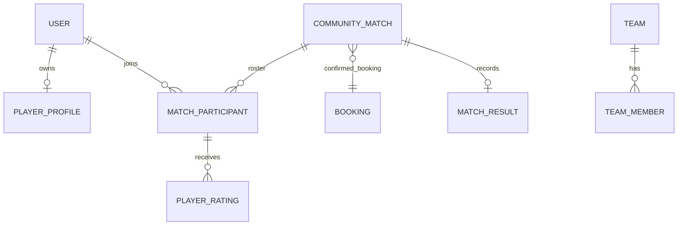

# Architecture Blueprint

## Existing inventory
| Existing | Location | Reuse | Extension/risk |
|---|---|---|---|
| `Match`, `MatchParticipant`, statuses/policies | `backend/app/models/match.py` | Yes | Existing foundation already handles join/capacity; do not duplicate join requests. |
| Match service/API | `services/match_service.py`, `api/v1/endpoints/matches.py` | Yes | Evolve service transactions and public schemas. |
| Booking one-to-one match link | `models/booking.py` | Yes | Confirmed booking is MVP source of schedule truth. |
| User roles/auth | `models/user.py`, dependencies | Yes | Host is ownership, not a new global role. |
| Reviews | `models/review.py` | No direct reuse | Court reviews differ from peer ratings. |

MVP: public/private matches, host moderation, roster/capacity, positions/skill, player profile, minimal teams, results, peer ratings and in-app notifications. Later: chat, payments, tournaments, media, analytics, referees, feeds.

Recommendation: retain existing `Match` as the aggregate; add only profile, requirements, teams, results, ratings and notifications after auditing its columns in 11B. Booking is optional for draft/external-location discussion, but public bookable-court MVP matches must link one confirmed booking; copied dates are forbidden.
